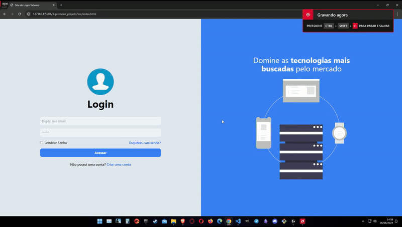

# Página de Login com Tailwind

Página de login feito com tailwind. Projeto realizado para treinar o framework tailwind css.

[Link do TailwindCSS](https://tailwindcss.com/)

Feito uma tela de login simples, com uma imagem e um formulário de login, com animações nativas do tailwind e toltamente responsivo.

# Tecnologias 🚀

- 
HTML 

- 
CSS 

- 
Tailwind CSS

- 
NPM

- 
Git

- 
GitHub

